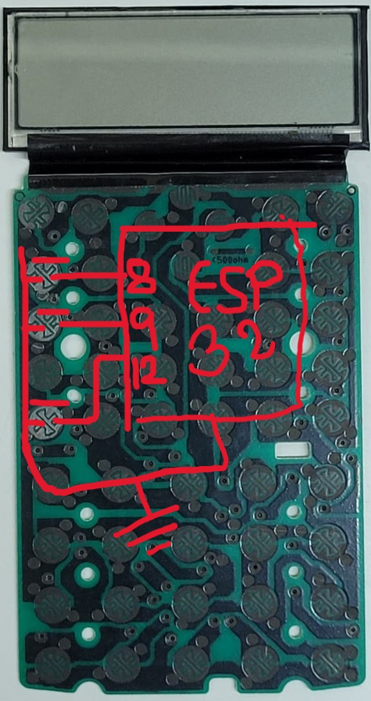
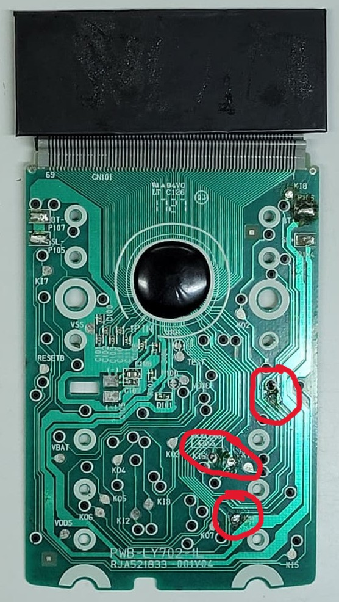
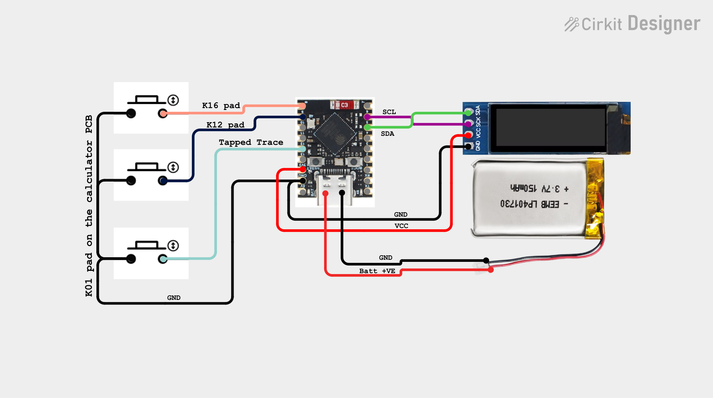

# Cheating Calculator (ESP32-S3)

> ⚠️ **Disclaimer**
> This project is built **strictly for educational and experimental purposes**. It demonstrates embedded systems, low-power design, and hardware hacking concepts. Do **not** misuse this project in real exams or unethical scenarios.

---

## 📦 Project Overview

This project converts a normal scientific calculator into a **smart ESP32-based device** using an **ESP32-S3 Super Mini**. It features a hidden OLED display, magnetic power control, Wi-Fi file upload, and low-power operation.

---

## 🧰 Components Used

* ESP32-S3 Super Mini
* 128×32 OLED Display (I²C)
* Reed Switch (magnetic power control)
* 450mAh Li-ion Battery
* Scientific Calculator (donor body & buttons)
* Wires, black electrical tape
* USB-C cable

---

## 🔌 Pinout Used

### OLED Display (I²C)

* **GPIO 5** → SDA
* **GPIO 6** → SCL

### Calculator Buttons

* **GPIO 8**
* **GPIO 9**
* **GPIO 12**

Only **3 GPIOs** are used to interface all buttons.

---

## 🛠️ Step-by-Step Build Process

### 1️⃣ Opening the Calculator

Carefully open the calculator casing without damaging the front keypad or PCB.

---

### 2️⃣ Identifying Button Pads

Use the image below to identify which calculator button pads are required.

*(Shows the calculator buttons used in this project)*

These pads will be connected to ESP32 GPIOs.

---

### 3️⃣ Tapping the Button Traces

Instead of individual buttons, traces are tapped directly to reduce wiring.

*(Shows where wires are soldered onto PCB traces)*

Carefully solder thin wires to these traces.

---

### 4️⃣ Connecting the ESP32-S3

* Connect the button wires to **GPIO 8, 9, and 12**
* Connect the OLED display to **GPIO 5 (SDA)** and **GPIO 6 (SCL)**

Ensure proper grounding and short wire lengths.

---

### 5️⃣ Power & Battery Setup

* Battery positive → ESP32 power terminal
* Battery negative → **Reed switch → ESP32 GND**

This allows the device to turn ON only when a magnet is nearby.

---

### 6️⃣ Fitting Components Inside the Case

* Remove excess plastic from inside the calculator shell
* Carefully place the ESP32, OLED, and battery
* Use black electrical tape to hide the OLED from the front

Mark the visible text area beforehand.

---

### 7️⃣ Closing the Back Cover

The back cover will not fit immediately.

✔️ Apply **patience** and small adjustments
✔️ Avoid pressing directly on the OLED

Once adjusted, the cover fits securely.

---

## 📡 File Upload Process (Wi-Fi)

1. Power the calculator using the **USB-C port**
2. Go to the **Wi-Fi Upload** option on the device
3. Connect your phone/PC to the calculator’s Wi-Fi
4. Enter the password shown on the OLED
5. Open a browser and visit the **IP address displayed**

> *(Future upgrade: clickable text link on OLED)*

### Uploading Files

* Only **.txt files** are supported
* Click **Upload**, select file, and upload
* File appears instantly on the calculator

### Deleting Files

* Reconnect to the calculator Wi-Fi
* Open the same web interface
* Delete files directly from the browser

---

## 🔋 Charging the Battery

1. Press & hold the **panic button** to turn off the screen
2. Bring a magnet near the reed switch
3. Blue LED ON → Battery charging

⏱️ **30 minutes charging ≈ 3+ hours backup**

---

## 🚀 Final Notes

This project is a combination of:

* Embedded programming
* Power optimization
* Hardware reverse engineering
* Creative enclosure hacking

Feel free to modify, improve, or learn from it.

---

### 🙌 Thanks for checking out this project

If you liked it, consider starring ⭐ the repo and following for more ESP32 projects!
